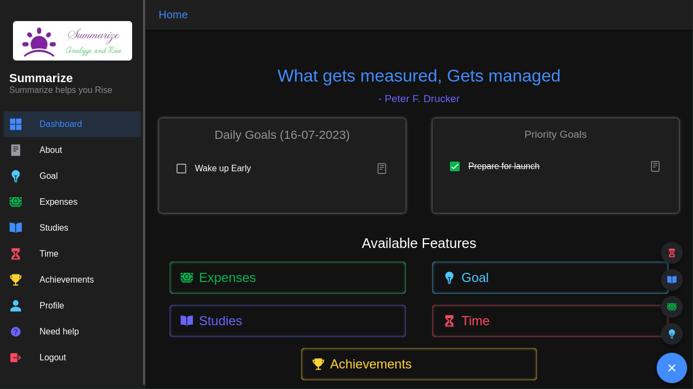
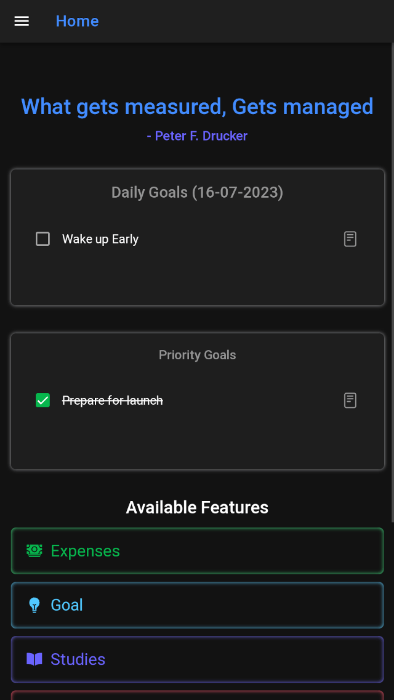

# Summarize

Summarize is an all-in-one productivity application designed to help you manage your time, finances, achievements, and studies efficiently. With Summarize, you can streamline your daily tasks, track your expenses, set and achieve goals, and organize your study materials—all in one place.

## Features

### Task Management
Stay organized and productive by managing your tasks effectively. Create to-do lists, set deadlines, and prioritize tasks to ensure you stay on top of your workload.

### Finance Tracking
Keep track of your expenses and finances effortlessly. Summarize provides intuitive tools to monitor your spending, set budgets, and analyze your financial habits.

### Goal Setting and Achievement
Set personal and professional goals, and track your progress towards achieving them. Celebrate your accomplishments and stay motivated on your journey to success.

### Study Planner
Optimize your study schedule and enhance your learning experience with Summarize's study planner. Organize your study materials, create study plans, and track your academic progress.

## Getting Started

To get started with Summarize, simply visit [https://summarize-ng.web.app/](https://summarize-ng.web.app/). Sign up for an account to unlock all the features and start managing your time, finances, achievements, and studies more effectively.

## Contributing

We welcome contributions from the community to help improve Summarize and make it even better. If you'd like to contribute, please see the [Contributing Guidelines](CONTRIBUTING.md) for more information.

## License

This project is licensed under the [MIT License](LICENSE.md). See the `LICENSE.md` file for details.

## Feedback and Support

Have feedback or need support? Feel free to [submit an issue](https://github.com/iam5k/summarize/issues) on GitHub or on [https://summarize-ng.web.app/help](https://summarize-ng.web.app/help)  or reach out to us at [iam5k.work@gmail.com](mailto:iam5k.work@gmail.com).

---

If you find Summarize helpful, don't forget to share it with your friends and colleagues. Happy organizing!
